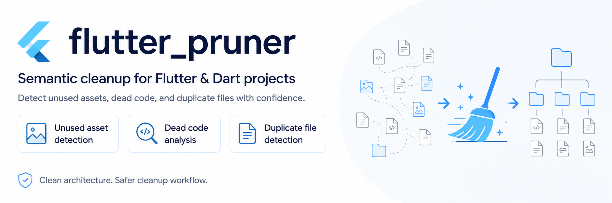

# Flutter Pruner

<p align="center">
  
</p>

<p align="center">
  <a href="https://pub.dev/packages/flutter_pruner"></a>
  <a href="https://pub.dev/packages/flutter_pruner/score"></a>
  <a href="https://pub.dev/packages/flutter_pruner"></a>
</p>

<p align="center">
  <a href="https://github.com/nhan7777/flutter_pruner/actions/workflows/ci.yml"></a>
  <a href="https://pub.dev/publishers/nhanlee.dev"></a>
  <a href="https://dart.dev/"></a>
  <a href="https://github.com/nhan7777/flutter_pruner/actions/workflows/ci.yml"></a>
  <a href="analysis_options.yaml"></a>
  <a href="LICENSE"></a>
</p>

<p align="center">
  <a href="https://github.com/nhan7777/flutter_pruner/stargazers"></a>
  <a href="https://github.com/nhan7777/flutter_pruner/issues"></a>
  <a href="https://github.com/nhan7777/flutter_pruner/commits/main"></a>
</p>

<p align="center">
  <strong>Safety-first semantic cleanup for Dart and Flutter.</strong><br>
  Find unreachable Dart declarations, unused Flutter assets and byte-identical
  duplicates, then apply only what the configured safety policy allows.
</p>

<p align="center">
  <a href="#quick-start">Quick start</a> ·
  <a href="#what-it-finds">What it finds</a> ·
  <a href="#safety-model">Safety model</a> ·
  <a href="#reports">Reports</a> ·
  <a href="#documentation-and-support">Documentation</a>
</p>

Flutter Pruner connects Dart declarations, libraries and assets in one semantic
graph. Every finding receives an evidence-backed confidence tier, while the
apply workflow adds planning, byte snapshots, quarantine and verified rollback.

> **Safety first:** start from a clean Git worktree. `scan` and
> `apply --dry-run` do not change project sources or assets; `scan` does write a
> report under `.flutter_pruner/`. Only run `apply` after reviewing its plan and
> the [documented boundaries](#important-boundaries).

## Quick start

Flutter Pruner requires Dart SDK 3.9 or newer.

### Install the CLI

```bash
dart pub global activate flutter_pruner
```

If `flutter_pruner` is not found, add Pub's executable directory to your
[`PATH`](https://dart.dev/tools/pub/cmd/pub-global#running-a-script-from-your-path).
In environments where a global executable is unavailable, such as CI, use:

```bash
dart pub global run flutter_pruner:flutter_pruner <command>
```

### Run the safe workflow

From the root of the Flutter or Dart project you want to analyze:

```bash
# 1. Detect the project and create .flutter_pruner/config.yaml
flutter_pruner init

# 2. Analyze without changing project sources or assets
flutter_pruner scan

# 3. Preview the eligible plan without applying it
flutter_pruner apply --dry-run

# 4. Apply only the findings authorized by the configured mode
flutter_pruner apply
```

| Step | Purpose | Project sources/assets |
|---|---|---|
| `init` | Declare project type, targets, entrypoints and verification | Unchanged |
| `scan` | Build the graph, classify findings and save a report | Unchanged |
| `apply --dry-run` | Validate and preview the eligible plan | Unchanged |
| `apply` | Quarantine originals, mutate, rescan and verify | May change |

The `init` wizard never marks target coverage complete by inference; completeness
is an explicit project-owner assertion. Reusable packages default to a
non-actionable open-world mode, so their dry-run and apply commands stay blocked
until an appropriate local boundary is explicitly configured.

To work from another directory, add `--project path/to/project` to any command.

Upgrade or uninstall the global executable with:

```bash
dart pub global activate flutter_pruner
dart pub global deactivate flutter_pruner
```

## What it finds

| Area | Detection | Apply policy |
|---|---|---|
| Dart | Unreachable top-level declarations and empty libraries | Confidence and mode controlled |
| Assets | Exact references and assets unreachable from live Dart code | Confidence and mode controlled |
| Routes | `go_router` declarations, redirects, nested routes, direct path/name navigation, and path navigation through resolved local wrappers | Review only |
| Dependency injection | Direct base-scope `GetIt` registrations and exact resolved lookups | Review only |
| Localization | ARB keys and current real-source `gen-l10n` accessors reachable from configured app targets | Review only |
| Duplicates | Byte-identical files grouped with SHA-256 | Review only |

## Why Flutter Pruner

- **Semantic, not grep-based.** Dart references are resolved through the
  analyzer's element model instead of source-text matching.
- **Cross-domain reachability.** Dead code does not keep an otherwise unused
  asset alive merely because its source contains the asset path.
- **Fail-closed confidence.** Dynamic references, incomplete targets, dangling
  graph facts and unsupported edits downgrade findings instead of being ignored.
- **Declared-scope analysis.** Every configured entrypoint is analyzed;
  conditional branches the graph cannot model keep coverage incomplete.
- **Verified whole-run recovery.** Every touched path is quarantined before
  mutation. If an apply run cannot finish, its mutations are restored to the
  run baseline and accepted only after byte and verification checks pass.
- **Audit-ready output.** Completed scans and handled apply outcomes save a
  structured report; HTML reports are self-contained and work offline.

## Safety model

### Choose the right analysis mode

The mode defines the analysis boundary and apply policy. It is not a shortcut
for increasing confidence.

| Mode | Use when | Result and actionability |
|---|---|---|
| `application` | The project owns the complete application boundary | Complete hard gates can produce `SAFE`; apply selects only `SAFE` |
| `package` | Unknown applications or packages may consume the public API | All non-protected findings are capped at `REVIEW`; apply and dry-run are disabled |
| `package-internal` | You intentionally want to clean only the local package boundary | Private local findings can be `SAFE`; external-consumer candidates may be `HIGH` only when that is their sole risk |

Reusable and hybrid projects are conservatively detected as `package`. Choose
`package-internal` explicitly when external consumers are intentionally outside
the scan:

```bash
flutter_pruner init --type package-internal
```

The interactive wizard always lists all three modes. Pressing Enter keeps the
detected conservative default; `package-internal` must be selected explicitly.
On supported terminals, semantic color and text weight distinguish sections,
defaults, confirmations, and risk warnings; icons and labels keep the same
meaning when ANSI styling is unavailable.

Both package modes require at least one `public_entrypoints` entry. Public
exports and their dependency closure remain reachable, so an exported API is
not reported unused merely because the package does not call it internally.

A generated package configuration contains the explicit boundary:

```yaml
analysis:
  mode: package-internal
  public_entrypoints: [lib/my_package.dart]
```

`init` writes the full target-matrix section and verification policy around it.

Every `package-internal` run warns that external consumers were not scanned.
A mutation containing eligible `HIGH` findings asks for `[y/N]`; CI can accept
that one specific risk with `flutter_pruner apply --yes`. The flag does not
bypass coverage, planning, verification or quarantine.

### Understand the confidence tiers

| Tier | Meaning |
|---|---|
| `SAFE` | All hard gates passed and no manual risk remains |
| `HIGH` | All hard gates passed and exactly one known manual risk remains |
| `REVIEW` | Evidence is incomplete, ambiguous, unsupported or has multiple risks |
| `PROTECTED` | Framework naming rules or dependency ownership forbid removal |

`PROTECTED` always wins. Conditional imports/exports, unresolved or dynamic
analysis, generated-code uncertainty, duplicate groups and unsupported editor
actions stay non-actionable rather than being silently promoted.

See the [confidence model](doc/confidence-model.md) for the complete policy.

## Preview, apply and rollback

Apply takes a project-local operation lock shared with rollback and quarantine
maintenance. Before mutation it rejects incomplete or non-terminal historical
quarantines, captures the verifier baseline, and builds a dependency-closed
plan. The plan may use internal atomic units, but the command is all-or-nothing:
if any unit, rescan, convergence check, canonical report, or recovery check
fails, it restores every mutation from this run to the original baseline and
verifies that recovery.

Use repeatable `--finding-id` values when the reviewed scope is smaller than
the full eligible set:

```bash
flutter_pruner apply --dry-run \
  --finding-id 'dart:my_app/lib/example.dart#_unusedHelper'
flutter_pruner apply \
  --finding-id 'dart:my_app/lib/example.dart#_unusedHelper'
```

IDs are exact and case-sensitive. The complete requested batch must exist, be
apply-eligible, and already be dependency-closed; the planner never adds an
unrequested logical finding. An unknown, non-actionable, or blocked requested
ID stops the whole batch before verification or quarantine creation (exit 2).
Empty or duplicate CLI values are usage errors (exit 64). Every rescan and the
final convergence check remain bound to the same allowlist, while unselected
findings stay visible in the report.

`recoveryRequired` means that restoration could not be proven (for example, a
timed-out mutation process could not be confirmed stopped). Stop using the
project with this tool, inspect the quarantine and report, and recover the
project before another mutating command. A successfully recovered failed run
does not retain earlier transactions.

To restore an applied run:

```bash
flutter_pruner quarantine list
flutter_pruner rollback <run-id>
```

Quarantine lives under `.flutter_pruner/quarantine/<run-id>`. Its manifest is a
revisioned, checksummed journal with staged recovery for interrupted replacement;
ambiguous or corrupt journal state blocks a new apply. Add `--clean` to the
rollback command only when the restored quarantine should also be removed.

For a regular-file edit, the original source path is renamed into quarantine
before a separately staged candidate is published with no-replace semantics.
Restore uses the same preserve-then-no-replace pattern: a concurrent recreation
of the project path is retained and the run becomes `recoveryRequired` instead
of overwriting it. This protects against observed path races; it is not a claim
of crash-durable filesystem transactions (see the boundaries below).

The rollback contract for a regular file is its captured bytes and, where the
platform exposes them, POSIX permission bits. It does **not** preserve extended
attributes, ACLs, ownership (`uid`/`gid`), or hard-link topology. Use version
control or a filesystem backup when those metadata matter.

## Reports

Every completed scan and handled apply outcome receives a unique report below
`.flutter_pruner/reports/`:

```text
scan-<run-id>.html
apply-<run-id>.html
```

No format or output option is required for the default searchable offline HTML
report. The terminal always shows the human summary and saved path. Export JSON
for CI or other machine consumers when needed:

```bash
flutter_pruner scan --format json
flutter_pruner apply --dry-run --report-format json
```

Use `--output` for scan or `--report-output` for apply only when CI needs a
stable artifact path. Mutating apply always keeps canonical JSON alongside the
quarantine, even when HTML is selected.

JSON schema v3 records coverage, blockers, findings, manual risks, verification
and transaction outcomes. See [structured run reports](doc/run-report.md) for
the schema, HTML features and CI selectors.

## Important boundaries

- `scan` never changes project sources or assets, but it does write its report
  under tool-owned `.flutter_pruner/` state.
- `target_matrix.complete: true` means the owner has declared every supported
  platform, flavor, entrypoint and Dart-define combination.
- `package-internal` proves only the local boundary; external apps may still use
  public symbols, deep imports or package assets.
- Built-in callback-handle boundaries cover `PluginUtilities.getCallbackHandle`,
  `Isolate.spawn`, and `Workmanager.initialize`; custom runtime registries must
  be modeled by a future adapter or protected by project policy.
- Asset paths assembled only by custom runtime code remain a trust boundary.
  Known dynamic or unresolved asset usage blocks affected findings, but the tool
  cannot prove that an unmodeled runtime API has no consumers.
- `GetIt` scopes, runtime or dynamic lookup state, and generated `Injectable`
  wiring are uncertainty boundaries. ARB/gen-l10n analysis targets current
  real-source output. These cases add scoped blockers rather than authorizing
  removal.
- Route and localization consumers are narrowed to the configured application
  entrypoint closure only when analyzer resolution proves that closure
  complete. Missing entrypoints, unresolved local directives, and conditional
  imports or exports keep the broader conservative scan and emit blockers.
- Configured verification and import cleanup run as argv-only subprocesses with
  deadlines and bounded captured output. An unconfirmed detached process tree
  produces `recoveryRequired`; Windows termination behavior is covered by the
  hosted release CI job.
- A subprocess that deliberately detaches before it can be observed remains a
  trust boundary; do not configure mutation-capable cleanup through such a tool.
- The local filesystem contract does not currently include directory `fsync`,
  `renameat2` durability semantics, or a guarantee against a microscopic
  open-file-descriptor append concurrent with path-level displacement. Treat a
  power loss or an adversarial writer during that window as requiring manual
  recovery, not as a proven atomic rollback.
- Rollback is not a blanket metadata restore: for regular files it restores
  captured bytes and POSIX permission bits where available, not xattrs, ACLs,
  `uid`/`gid`, or hard-link topology.
- Source-byte measurements are not release binary-size claims.

`BuildTarget` and `TargetMatrix` are public v1 Dart APIs. Their defensive
immutable snapshot behavior is intentional; source-breaking changes require a
future major release.

The public reporting and adapter-presentation DTOs likewise defensively snapshot
collection arguments, so collection-bearing constructors are intentionally
non-`const`. `VerificationPolicy` is exported for API callers. Treat
`AdapterRegistry.builtIn` as read-only at runtime; a custom adapter set is passed
explicitly to `AdapterRegistry.resolve(adapters: [...])`, while changes to the
built-ins belong in the registry initializer. These public API contracts follow
Semantic Versioning; source-breaking changes require a future major release.

When upgrading older configs, remove `analysis.root_coverage`. The only accepted
mode values are `application`, `package` and `package-internal`; the old
`workspace`, `--safe` and `--high` interfaces are intentionally rejected.

## Documentation and support

| Document | Start here for |
|---|---|
| [Architecture](doc/architecture.md) | Scan flow, layers and apply transactions |
| [Graph model](doc/graph-model.md) | Nodes, roots, reachability and blockers |
| [Confidence model](doc/confidence-model.md) | Safety gates and confidence tiers |
| [Project configuration](doc/flutter_pruner.yaml.md) | Config schema, coverage and verification policy |
| [Run reports](doc/run-report.md) | JSON v3, HTML and CI selectors |
| [Report schema migrations](doc/report-schema-migration.md) | Compatibility and deprecation policy |
| [V2 adapters](doc/v2-adapters.md) | As-built route, GetIt and localization behavior and boundaries |
| [Release readiness](doc/release-readiness.md) | Replay, real-project and performance gates |
| [Performance profiling](doc/performance/profiling.md) | Synthetic fixtures, benchmarks and privacy rules |
| [V2 natural accuracy](doc/performance/v2-natural-accuracy.md) | Real-project oracle method, corpus pins and retained results |
| [Verified Flutter facts](doc/flutter-facts.md) | Framework assumptions and primary sources |
| [Contributor guide](CONTRIBUTING.md) | Development setup and pull requests |
| [Adapter guide](doc/contributing/how-to-add-adapter.md) | Adding a new analyzer |

See [ROADMAP.md](ROADMAP.md) for planned work. Adapters are the main extension
point; the adapter guide includes a
[copyable template](doc/contributing/adapter-template.dart).

Found a bug or have a focused feature request? Open an
[issue](https://github.com/nhan7777/flutter_pruner/issues). To contribute code,
start with [CONTRIBUTING.md](CONTRIBUTING.md) and include regression evidence for
changes that affect confidence, mutation or recovery behavior.

## License

MIT — see [LICENSE](LICENSE).
